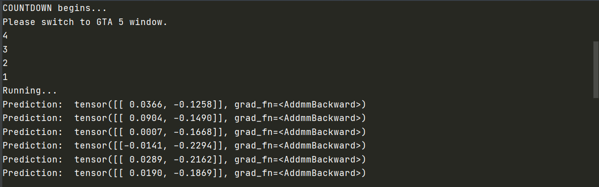
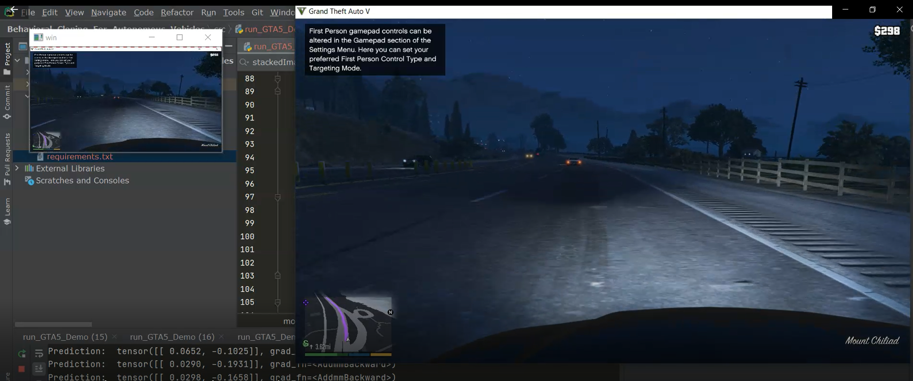

## Behavioral_Cloning_For_Autonomous_Vehicles

## Description
This is a project to develop a software package for Autonomous 
Vehicles using Behavioural Cloning.

## Dependencies
- Windows
- python-3.6.8
- GTA 5 Game 
- PyTorch-1.7.1 (latest at the time)
- opencv-python==3.4.6.27
- mss
- pyautogui
- numpy==1.18.0

## Instructions
Install Using Command Line
```
- git clone https://github.com/bhavinkothari57/bhavinkothari57-Behavioral_Cloning_For_Autonomous_Vehicles.git
- cd Behavioral_Cloning_For_Autonomous_Vehicles/src
- Install all dependencies in Requirements.txt
- python run_GTA5_Demo.py
```
Run Model
```
- cd models
- Open Model_Training.ipynb in Google Colab 
```
## Special Instructions
- Follow the steps above to verify if the code is running correctly.
- Once the program builds successfully, a Countdown of 5 seconds will appear.
- Once the countdown appears select the GTA 5 window and press ESC to un-pause the game.

## Sample Output
Console Window Output:



GTA 5 Screen Output:

